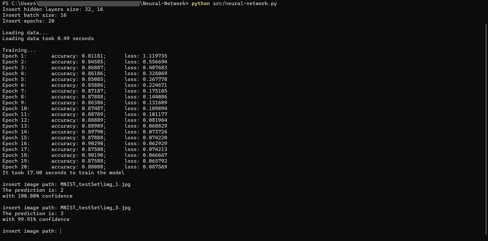

# NEURAL NETWORK

## Project Description
This project is a neural network built from scratch, using only Numpy to train the model and pandas for data loading.  
It enables training a neural network with dynamic hidden layers to classify digit images from the MNIST dataset.

## Installation
1. Clone the repository:
    ```bash 
    git clone https://github.com/SalerSimo/Neural-Network
    cd Neural-Network
    ```

2. Install the required python packages
    ```bash
    python install -r requirements.txt
    ```
## Usage
This repository includes a csv file named `datasetCsv`, containing 5000 images, 500 for each number from 0 to 9.  
The model will be automatically trained with this dataset.  
To test the model, there are 200 images in the folder `MNIST testSet`

It is also possible to save new dataset into a .csv file,  by running `src/store_dataset.py` and passing to it the path of the dataset.


1. Run neural-network.py:
    ```bash
    python src/neural-network.py
    ```

2. Customize the neural network by specifying the number of layers, batch size, and number of epochs.
3. Insert the path of the image you want to classify.

## Test
To test the model, I created a simple neural network with two hidden layers, the first of 32 neurons and the second of 16 neurons.  
Then I set the batch size to 16 and the number of epochs to 20.  
For testing it, I used these two images from the `MNIST_testSet` folder to test the model:  

`img_1.jpg`  and `img_5.jpg`   
Here is the result



